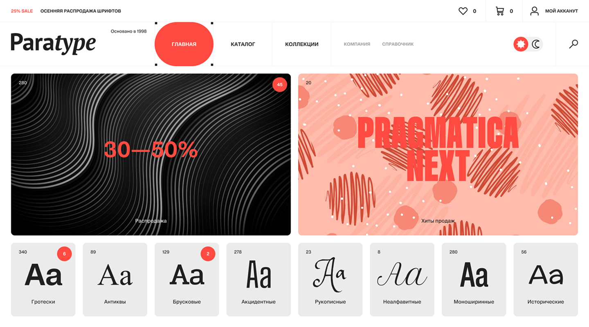

# 📋 Проект, выполненный в рамках Чемпионата по верстке 2025 «Paratype» 

**Самостоятельно выполненный проект, занявший 1 место в Чемпионате по верстке.**

Шрифт: https://www.paratype.ru/
Дизайн, макет: https://wemakefab.ru/
Организатор: https://htmlacademy.ru/



## 💡 Обзор выполненных задач

### ✔ Написание HTML-разметки
Создание семантически правильной и структурированной HTML-разметки, обеспечивающей доступность и SEO-оптимизацию.

### ✔ Адаптивная верстка на SCSS
- разработаны адаптивные стили с использованием SCSS, обеспечивающих корректное отображение сайта на различных устройствах (desktop, tablet, mobile).
- реализована **резиновая** верстка и **скейлинг** отдельных элементов, обеспечивающие масштабирование контента между брекпоинтами для гибкого отображения.
- использован подход **Mobile First**, гарантирующий оптимальное отображение на мобильных устройствах.

### ✔ Реализация JavaScript функциональности
Добавление интерактивных элементов и динамической логики с использованием JavaScript.  
Реализованы следующие функции в соответствии с ТЗ:
- открытие/закрытие мобильного меню в шапке сайта на мобильной и планшетной версиях.
- анимация ссылок в навигации по ховеру в десктопе.
- слайдеры в промо-блоке и в карточках шрифта с возможностью переключения слайдов с помощью кнопок пагинации и по свайпу на мобильной и планшетной версиях.
- всплывающая кнопка скролла к началу страницы (с использованием debounce).
- кастомный селект в блоке с карточками шрифтов на мобильной и планшетной версиях.
- смена изображения по ховеру в карточках шрифта на десктопе (с использованием debounce).
- раскрывающееся описание шрифта по ховеру на десктопной версии.
- раскрывающееся описание шрифта при нажатии на кнопку «+» на мобильной версии.
- валидация данных в форме подписки.
- кастомизация браузерных сообщений об ошибках при вводе невалидных данных и их вывод после попытки отправки формы.
- улучшение производительности за счет ограничения частоты вызовов функций, реализуемое с помощью функции debounce.
- корректный порядок фокуса при изменении сетки на разных версиях в хэдере и футере.


## 📖 Библиотеки

- проект выполнен без использования библиотек.


## 🛠 Технологии и инструменты

- HTML5
- SCSS
- JavaScript (ES6+)
- БЭМ-методология
- SVG-спрайты, WebP
- оптимизация графики, в т.ч. для Retina-дисплеев
- резиновая верстка
- скейлинг
- Git
- VS Code
- Figma


## 🚀 Установка и запуск:

**Установка Node.js и NPM**:
- Установите Node.js (поддерживаемые версии 18, 20, 22).
- Для установки зависимостей необходимо выполнить команду
```bash
npm ci
```

**Запуск проекта**:
- Запустите сервер с помощью команды
```bash
npm run start
```
- Сервер будет доступен по адресу `http://localhost:3000`.
